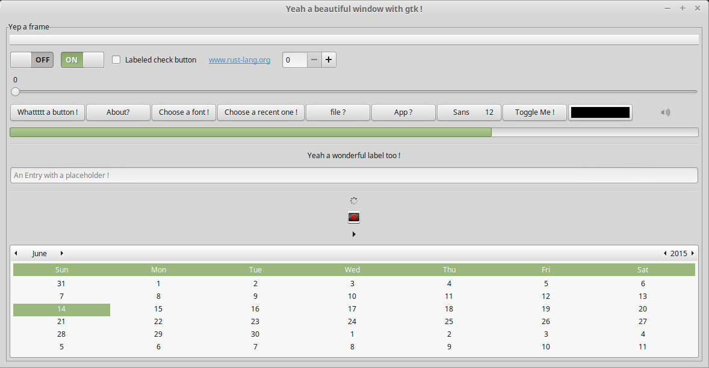

  

## [Rust] bindings for [GTK+ 3][GTK], [Cairo], [GtkSourceView] and other [GLib]-compatible libraries

[Rust]: https://www.rust-lang.org/
[GLib]: https://developer.gnome.org/glib/stable/
[GTK]: https://developer.gnome.org/gtk3/stable/
[Cairo]: http://cairographics.org/documentation/
[GtkSourceView]: https://wiki.gnome.org/Projects/GtkSourceView

  

  

    

      
 Crates 

      
    

    

      
 Announcements 

      
        {{ post.date | date: "%-d %b %Y" }}
        

          <a href="{{ post.url | prepend: site.baseurl }}">{{ post.title }}</a>
        

      
    

  

| Crate | Minimum supported version |
|-------|---------------------------|
| [atk](https://crates.io/crates/atk) | 2.30 |
| [cairo](https://crates.io/crates/cairo-rs) | 1.14 |
| [gdk](https://crates.io/crates/gdk) | 3.16 |
| [gdk-pixbuf](https://crates.io/crates/gdk-pixbuf) | 2.32 |
| [gio](https://crates.io/crates/gio) | 2.44 |
| [glib](https://crates.io/crates/glib) | 2.44 |
| [gtk](https://crates.io/crates/gtk) | 3.16 |
| [pango](https://crates.io/crates/pango) | 1.38 |
| [pangocairo](https://crates.io/crates/pangocairo) | 1.0 |
| [sourceview](https://crates.io/crates/sourceview) | 3.0 |

## Using

First, prepare your system by taking a look at the [requirements](http://gtk-rs.org/docs-src/requirements.html).

Then include `gtk` and `gio` in your `Cargo.toml` and set the minimal GTK version required by your project:


~~~toml
[dependencies.gtk]
version = "{{ gtk[0].max_version }}"
features = ["v3_16"]

[dependencies.gio]
version = "{{ gio[0].max_version }}"
features = ["v2_44"]
~~~

__The APIs aren't stable yet. Watch the Announcements box above for breaking changes to the crates!__

Import the `gtk` and `gio` crates and their traits:

~~~rust
extern crate gtk;
extern crate gio;

use gtk::prelude::*;
use gio::prelude::*;
~~~

Create an application, etc.

~~~rust
use gtk::{Application, ApplicationWindow, Button};

fn main() {
    let application = Application::new(
        Some("com.github.gtk-rs.examples.basic"),
        Default::default(),
    ).expect("failed to initialize GTK application");

    application.connect_activate(|app| {
        let window = ApplicationWindow::new(app);
        window.set_title("First GTK+ Program");
        window.set_default_size(350, 70);

        let button = Button::new_with_label("Click me!");
        button.connect_clicked(|_| {
            println!("Clicked!");
        });
        window.add(&button);

        window.show_all();
    });

    application.run(&[]);
}
~~~

## Using latest, not published version

Include `gtk` in your `Cargo.toml` not as crate but from git:

~~~toml
[dependencies.gtk]
git = "https://github.com/gtk-rs/gtk"
features = ["v3_16"]
~~~

## Projects using gtk-rs
* [Banner Viewer](https://gitlab.gnome.org/World/design/banner-viewer)
* [BrewStillery](https://gitlab.com/MonkeyLog/BrewStillery)
* [Contrast](https://gitlab.gnome.org/World/design/contrast)
* [Epicwar Downloader](https://github.com/ab0v3g4me/epicwar-downloader)
* [Font Finder](https://github.com/mmstick/fontfinder)
* [Fractal](https://gitlab.gnome.org/danigm/fractal)
* [Garta](https://github.com/zaari/garta)
* [Gattii](https://gitlab.com/susurrus/gattii)
* [GNvim](https://github.com/vhakulinen/gnvim)
* [glide](https://github.com/philn/glide)
* [gpsami](https://github.com/hfiguiere/gpsami)
* [Icon Library](https://gitlab.gnome.org/World/design/icon-library)
* [Marmoset](https://github.com/sprang/marmoset)
* [mcmmtk](https://github.com/pwil3058/mcmmtk)
* [media-toc](https://github.com/fengalin/media-toc)
* [neovim-gtk](https://github.com/daa84/neovim-gtk)
* [noaa-apt](https://github.com/martinber/noaa-apt)
* [pcatk](https://github.com/pwil3058/pcatk)
* [PNMixer-rs](https://github.com/hasufell/pnmixer-rust)
* [Podcasts](https://gitlab.gnome.org/World/podcasts)
* [Popsicle](https://github.com/pop-os/popsicle/)
* [process-viewer](https://github.com/GuillaumeGomez/process-viewer)
* [relm](https://github.com/antoyo/relm)
* [rrun](https://github.com/buster/rrun)
* [Shortwave](https://gitlab.gnome.org/World/Shortwave)
* [Social](https://gitlab.gnome.org/World/Social)
* [SolidOak](https://github.com/oakes/SolidOak)
* [systemd-manager](https://github.com/mmstick/systemd-manager)
* [Tau](https://gitlab.gnome.org/World/Tau)
* [tv-renamer](https://github.com/mmstick/tv-renamer)
* [Way Cooler](https://github.com/way-cooler)
* [Whatschanging](https://github.com/mothsART/whatschanging)

If you want yours to be added to this list, please create a [Pull Request](https://github.com/gtk-rs/gtk-rs.github.io/compare?expand=1) for it!
